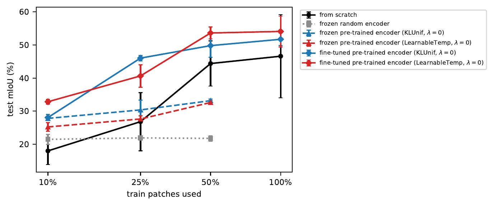

# Contrastive pre-training of a complex-valued SegFormer for PolSAR segmentation

Code of my (Emmanuel BENICHOU) master thesis at CentraleSupélec and the SONDRA laboratory, supervised by
Jérémy FIX, revised in September 2026. The thesis report is in
[docs/master_thesis_Emmanuel_Benichou.pdf](docs/master_thesis_Emmanuel_Benichou.pdf). 

The co-authors of the original project (extending to more subjects such as triplet losses, benchmarks with UNet architecture...) were Rodolphe DURAND and Lazare PLISSON-ARCOS.

A complex-valued SegFormer built on [torchcvnn](https://github.com/torchcvnn/torchcvnn)
segments the ALOS-2 scene of San Francisco into the six land-cover classes of
[PolSF](https://arxiv.org/abs/1912.07259). Its encoder is first pre-trained on the
unlabelled part of the scene with one contrastive loss per stage, the stages being weighted
either by a softmax with a KL penalty (`NTXentKLUnif`) or by learnable temperatures
(`NTXentLearnableTemp`).

## Result



Test mIoU against the share of the 2038 labelled train patches used, mean and standard
deviation over 3 seeds, every run taking the same number of gradient steps. A fine-tuned
pre-trained encoder has a higher mean than training from scratch at every fraction: by 10 to
19 points on 10 and 25% of the patches, by 5 to 9 points from 50%. It also has less variance
across the seeds. Frozen, the pre-trained encoders still beat a frozen random one, so the representation itself holds some information about the classes.

## Setup

```bash
uv sync
```

Put the ALOS-2 archive of the [IETR](https://ietr-lab.univ-rennes1.fr/polsarpro-bio/san-francisco/)
(`VOL-`, `LED-` and `IMG-` files) and the label map `SF-ALOS2-label2d.png` of
[PolSF](https://github.com/liuxuvip/PolSF) in one directory, and point `data.root_dir` of
the configs at it, or set `POLSF_ROOT`. Runs are logged to Weights & Biases: `wandb login`,
or `WANDB_MODE=offline`.

## Usage

```bash
# a single run / novis stands for no visualisation
uv run python -m src.torchtmpl.main configs/baseline_segformer.yaml train novis

# the experiments of the thesis, logged in logs/sweep/
ENCODERS=pretrain-NTXentKLUnif-lambda0,pretrain-NTXentLearnableTemp-lambda0
uv run python -m scripts.sweep pretrain --seeds 0
uv run python -m scripts.sweep finetune --encoders $ENCODERS --seeds 0,1,2
uv run python -m scripts.sweep frugal --encoders $ENCODERS --seeds 0,1,2
uv run python -m scripts.sweep summary
```

## Notes on torchcvnn 0.9.4

- `LayerNorm` computes its statistics across the batch rather than within each sample, so
  a prediction depends on the other patches of its batch (still the case in 0.10.0). The
  SegFormer uses the complex `BatchNorm2d` instead.

## Licence

MIT, see [LICENSE](LICENSE).
